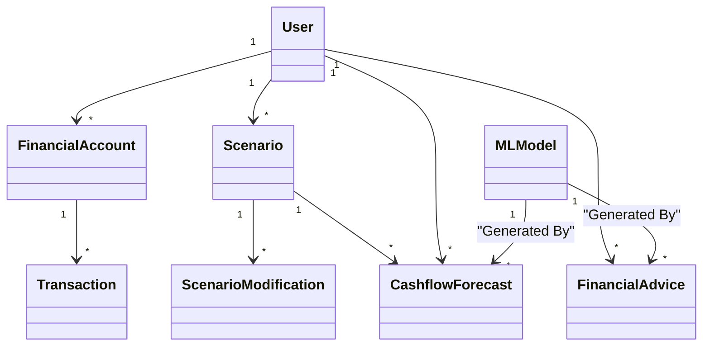

# AI Personal CFO - Database Schema Documentation

This repository contains the SQLAlchemy ORM models for a production-grade Personal CFO application.

## 1. Schema Overview

The schema is designed to separate **Core Financial Data** (immutable facts) from **Derived Intelligence** (forecasts, scenarios).

### Core Tables
| Table | Description |
|-------|-------------|
| `users` | The central entity. Stores profile info and preferences (JSONB). |
| `financial_accounts` | Mirrors real-world bank accounts. Stores current balance and institution metadata. |
| `transactions` | The ledger of truth. Optimized for time-range queries. Includes `raw_import_data` for auditability of CSV/Bank imports. |

### Intelligence & Forecasting
| Table | Description |
|-------|-------------|
| `cashflow_forecasts` | Daily/Weekly projected balances. Linked to specific Scenarios. Allows comparing "Baseline" vs "Scenario A". |
| `ml_models` | Registry of ML model versions. Ensures we know *which* model generated a specific forecast or advice. |

### Simulation (What-If)
| Table | Description |
|-------|-------------|
| `scenarios` | A container for a set of assumptions. `is_baseline=True` is reality; others are hypothetical. |
| `scenario_modifications` | The "diffs" applied to a scenario (e.g., "Add $500 monthly expense"). |

### Advisory
| Table | Description |
|-------|-------------|
| `financial_advice` | Actionable insights generated by the AI. Linked to specific transactions or model versions. |

## 2. Key Design Decisions

- **UUIDs**: Used for all Primary Keys to ensure security and scalability.
- **Fixed-Point Arithmetic**: `Decimal` (Numeric) is used for all monetary values to prevent floating-point errors.
- **JSONB Usage**: Used for `preferences`, `provider_metadata`, and `parameters` to allow schema evolution without downtime.
- **Time-Series Indexing**: Composite indexes on `(user_id, date)` fields ensure dashboard queries remain fast as data grows.

## 3. Relationships Diagram (Textual)



## 4. Usage

Ensure you have `sqlalchemy` and `psycopg2` (or another driver) installed:
```bash
pip install sqlalchemy
```

Import the models:
```python
from database_schema import User, Transaction, engine
```
